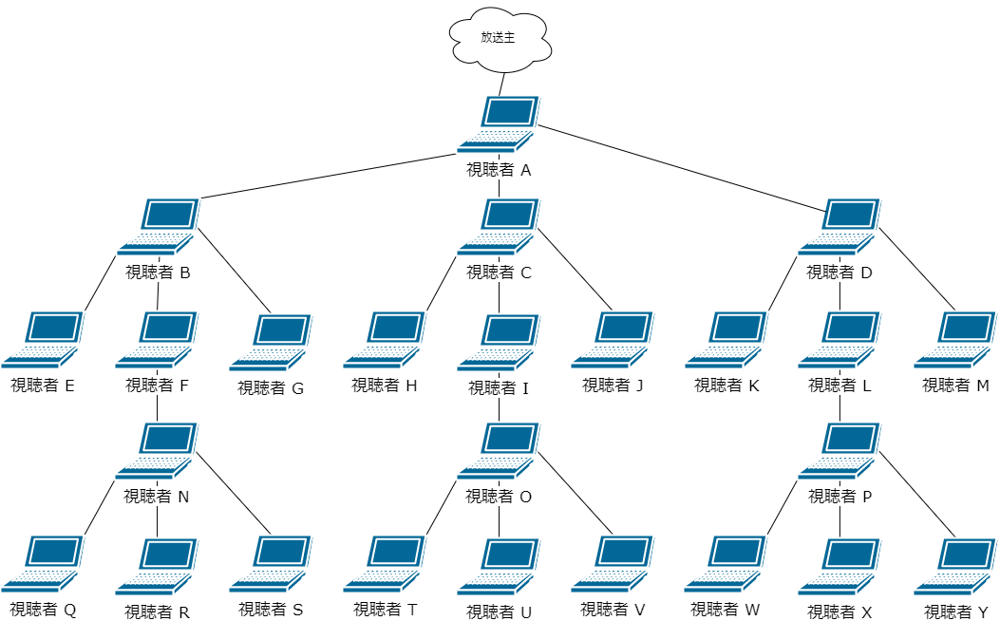
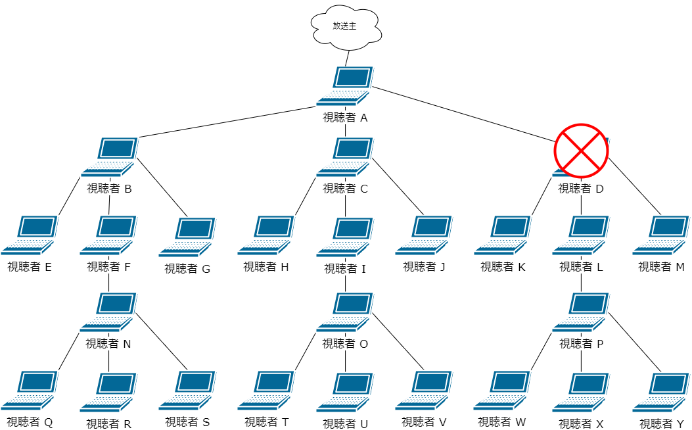
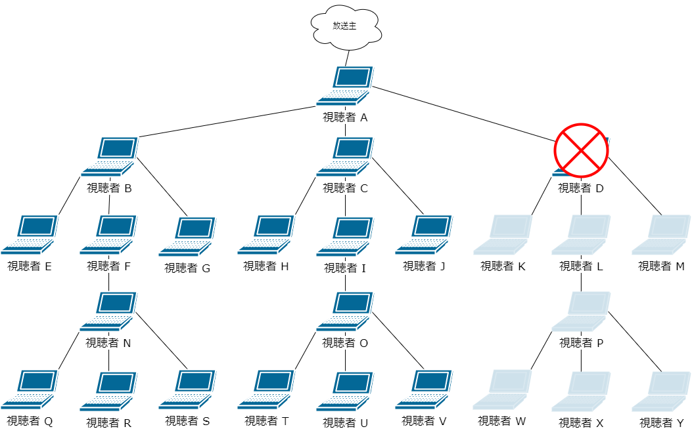
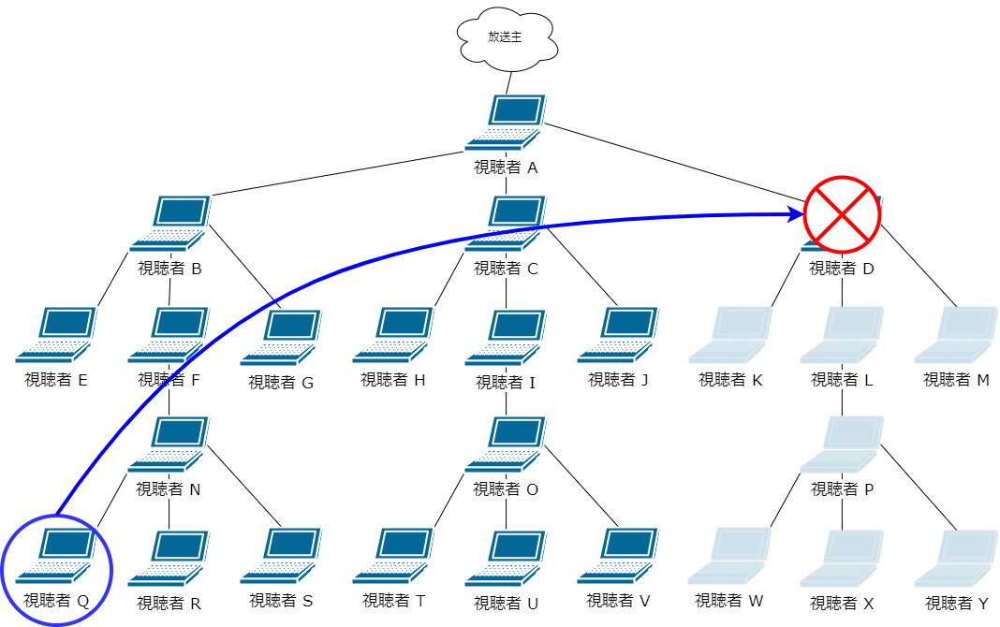
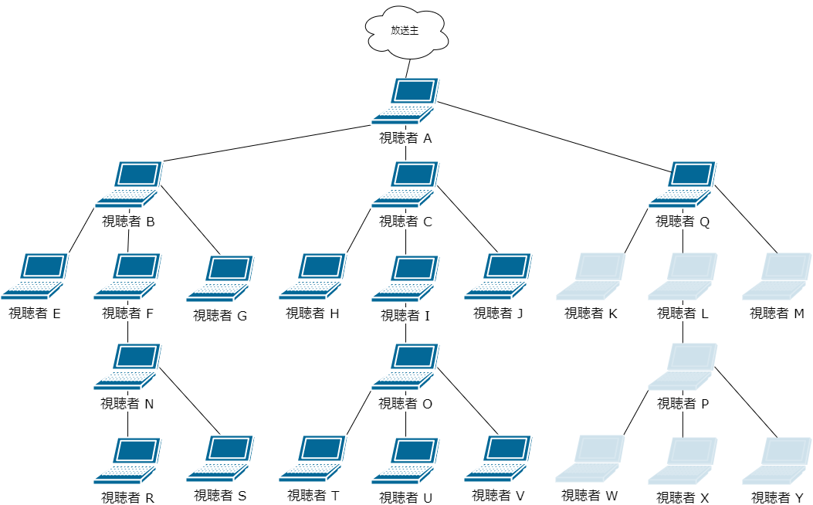
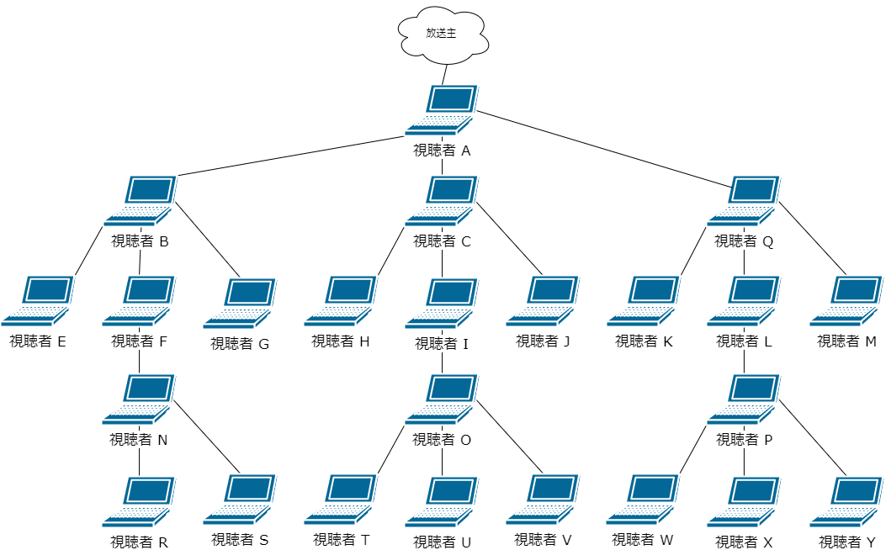

# skyway_peerjs_stream_relay


## 注意点
* このrelayライブラリは、peer.js自体に手を入れることはせず、ライブラリ外から拡張するという方法をとっている
* ニコ生で補助的に動画配信を行うことを目的に実装。
なので、放送主(ルート)のIDがWebRTC側でのメッセージのやり取り無しで取得できるのが前提。

## 導入方法
peer.js必須。peer.jsとpeerjsextend.jsをロードする。
```html
<script src="peer.min.js"></script>
<script src="peerjsextend.js"></script>
```

放送主(ルート)のIDが取得できるようになった後に、以下のようにPeerインスタンスを生成し、Peerインスタンスの'open'イベントで、以下のようにpeerInstanceExtend()を呼ぶ。
peerInstanceExtend()の引数で放送主(ルート)のユーザーIDと、分配数を設定する。
(ライブラリを拡張するという実装方法をとっているため)
```js
var peer = new Peer('root', { key: apiKey, debug: 3 });
peer.on('open', id => {
    peerInstanceExtend(peer, rootId, 5);
});
```

## 視聴者の参加
視聴者が参加すると放送主(ルート)に'join'メッセージを送信する。
ただし、放送主(ルート)が放送を中断している(マシン再起動など)場合があるため、'join'メッセージは3秒感覚でポーリングする。
放送主(ルート)は'join'メッセージを受信すると、メッセージを送信した視聴者をツリーに追加(addBranch())する。

## ストリーム(映像/音声)のリレー
放送主の負荷を少しでも減らすため、放送主からいきなり分配するのではなく、第一視聴者("視聴者 A")は放送主と1：1となる、分配は第一視聴者("視聴者 A")から分配を開始する。  

peerInstanceExtend()で設定した分配数が3だった場合の図
(配下にないところは省略している。実際は配下に3つずつ連なる)



## リレー途中の視聴者が視聴をやめた(接続が切れた)場合
リレー途中の視聴者が視聴をやめた場合、リレーの末端の視聴者を視聴をやめた視聴者の位置に配置し、再配信を行う。  
これらリレー配置の管理は放送主側で一元的に管理を行っている

### 例えば"視聴者 D"が視聴をやめた場合
1. "視聴者 D"が視聴をやめる

2. "視聴者 D"配下の視聴者への配信が止まってしまう。

3. リレー末端の"視聴者 Q"を"視聴者 D"の位置に配置する。


4. "視聴者 Q"配下へ再配信する


### リレー途中の視聴者が視聴をやめた場合の具体的なメッセージのやり取り
1. "視聴者 D"はリレー元の"視聴者 A"および、リレー先の"視聴者 K", "視聴者 L", "視聴者 M"の4者にコネクションを張っているため、"視聴者 D"の'close'イベントはこの4者に発生するが、配信元の"視聴者 A"で発生した'close'イベントで、放送主に"視聴者 D"がcloseしたという'close_branch'メッセージを送信する。
2. 放送主は、'close_branch'メッセージを受け取ると、リレー末端の"視聴者 Q"の再配置を行う。(peer.migrateBranch())
この時、実際に"視聴者 Q"の再配置を行う際に"視聴者 Q"をいったん閉じるので、1.の'close'イベントによる'close_branch'メッセージ送信ロジックにより、"視聴者N"から'close_branch'が送信されてしまう。そのメッセージを無視するように、ignoreリストに登録しておく。
3. 配置結果のデータ(branchData)を"視聴者 Q"に送信する。
4. "視聴者 Q"は、branchDataを受信すると、まず"視聴者 N"とのコネクションを閉じた後、branchDataをもとに、映像受信だけのネゴシエーションはできないが逆に映像送信だけのネゴシエーションはできるため、"視聴者 A"(リレー元)に'request_stream'メッセージを送る。
5. "視聴者 A"は'request_stream'メッセージを受信すると、"視聴者 Q"とのリレーを開始する。
6. "視聴者 Q"は"視聴者 A"から送られてきた映像を"視聴者 K", "視聴者 L", "視聴者 M"に分配し、それ以降、同様にさらに配下へと分配される。

## 放送主が放送を中断(コネクション切断)し、(同一枠内で)放送を再開した場合
SkyWay(のSDK)ではルーム機能がない。ユーザーリストを取得する機能はあるのだが、これはサービス全体のユーザーが対象となるため、他の放送のユーザーも取得されてしまう。
なので、SkyWayのユーザーリスト取得機能は使用しない。  
同一枠内で放送再開した場合は、保存しておいたリレー情報をもとに視聴者に'reconnect_root'メッセージを送信する。  
リレー情報はいったん破棄し、視聴者0人の状態にリセットし、'reconnect_root'メッセージを受信した視聴者は再度、ルームに参加した時に送信する'join'メッセージを再度送信することで(再度参加するという手順をとることで)再配信を行う。


## 問題点
リレー途中の視聴者が視聴をやめた場合、その配下にいる視聴者への再配信は、すべてコネクション(RTCPeerConnection)の再作成で行うため、再配信されるまで映像が止まってしまう(表示されない)。  
放送IDとニコ動のユーザーIDをIDに設定しているため、別窓を使用しての同じ放送を同時視聴するということはできない。